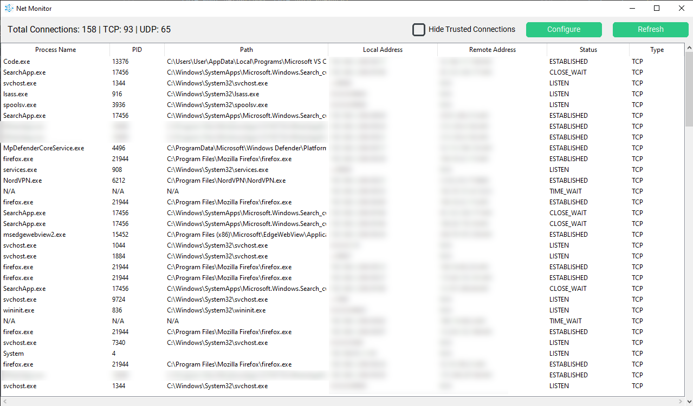
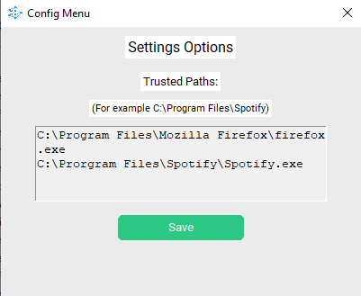

# Net Monitor by Aidan Butler

Net Monitor is a Windows application which works in a similar fashion to **tcpview**, however gives users the ability to filter out any connections established by Windows processes, or by applications specified through the settings menu. 

This enables users to more efficiently analyse their network traffic and identify anomalies.

## How to install & run

1. Clone this repository by using the git CLI command "git clone https://github.com/adn-b/net-monitor"
2. Navigate into the directory with "cd net-monitor"
3. Run the application with "python app.py". 
4. Alternatively, you can run the "NetMonitor.exe" executable file which can be found in the root of the "app" directory.

## How to configure trusted paths

To add file directories to the whitelist, click on the "Configure" button at the top right of the application, and enter the file path in the format indicated above the entry box.

